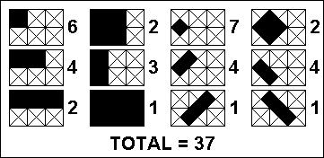

## Задание

В сетке размером 3×2, где клетки закрашены по диагонали (cross-hatched), может быть размещено всего 37 различных прямоугольников, как показано на схеме.

Существует 5 меньших по размеру сеток, чем 3×2, где важны и вертикальный, и горизонтальный размеры (то есть, 1×1, 2×1, 3×1, 1×2, 2×2). Если каждая из них также закрашена по диагонали, то возможное количество прямоугольников в каждой из них следующее:

1×1 → 1

2×1 → 4

3×1 → 8

1×2 → 4

2×2 → 18

Сложив все эти значения с 37 прямоугольниками для сетки 3×2, получаем:

Всего прямоугольников в сетках до 3×2 включительно: 1 + 4 + 8 + 4 + 18 + 37 = 72

Теперь вопрос:

Сколько различных прямоугольников можно построить во всех сетках с размерами от 1×1 до 47×43 включительно?

То есть:
- мы берём сетку 1×1 → считаем количество прямоугольников в ней,
- затем 1×2, 1×3, ..., 1×43,
- потом 2×1, 2×2, ..., 47×43 — все возможные пары (width, height), где 1 ≤ width ≤ 47, 1 ≤ height ≤ 43.

---

### Краткое решение

---

### Решение

Мы подходим к этой задаче как к задаче динамического программирования, где количество прямоугольников в сетке X на Y считается как количество прямоугольников в сетке (X-1) на Y плюс количество прямоугольников, которое добавляется при добавлении нового столбца. Мы также делаем некоторые упрощения, предполагая, что X >= Y (то есть ширина сетки всегда больше либо равна высоте). Это допустимо, потому что количество прямоугольников в сетке X на Y совпадает с количеством прямоугольников в сетке Y на X. Также известно, что в сетке 1x1 помещается ровно один прямоугольник. 

Теперь мы можем сосредоточиться на том, сколько новых прямоугольников может быть создано при добавлении новой колонки в сетку. Очевидно, эти прямоугольники должны включать хотя бы одну ячейку новой колонки (или частично включать, в случае диагональных прямоугольников). Мы можем дополнительно разделить эти новые прямоугольники на два случая:
1. Прямоугольники, стороны которых параллельны границам сетки
2. Прямоугольники, стороны которых диагональны относительно границ сетки

---

Случай 1: Прямоугольники, параллельные границам.

Мы начинаем с анализа, как можно заполнить новую колонку прямоугольниками, которые полностью помещаются в ней. Если новая колонка имеет высоту Y, то в неё явно помещается Y прямоугольников 1x1. Аналогично, в неё помещается Y-1 прямоугольников 1x2 и так далее, пока мы не закончим одним прямоугольником 1xY. Это означает, что в новую колонку помещается ровно 1 + 2 + … + Y прямоугольников. 
Заметьте, что каждый из этих прямоугольников также может быть расширен вдоль оси X, чтобы образовать новые прямоугольники. Это означает, что общее количество прямоугольников, параллельных сторонам сетки, равно (1 + 2 + … + Y) * X.

---

Случай 2: Диагональные прямоугольники.

Мы начинаем с построения диагональных прямоугольников, у которых правый верхний угол находится в новой колонке. 
Диагональный прямоугольник имеет правую вершину (верхнюю или нижнюю), которая находится в новой (последней) колонке. Это вершина может быть:
- в вершине клетки (на границе),
- или внутри клетки, если диагонали проходят по центру.

Мы отмечаем, что существует 2Y - 1 вершин, из которых можно построить такие прямоугольники. Начиная с верхней части колонки и двигаясь вниз, мы можем пронумеровать их 1, 2, … 2Y - 1. Вершина i = Y — это середина, она образует квадрат, в то время как остальные формируют прямоугольники, которые не являются квадратами. 
Также существует свойство симметрии для этих прямоугольников: первый прямоугольник является зеркальным отражением (одинакового размера, но с другим расположением) последнего прямоугольника, второй — зеркальное отражение второго с конца и т.д. Это означает, что нам нужно вычислить площади только первых Y диагональных прямоугольников с вершиной в новой колонке.
Правило для количества диагональных прямоугольников можно установить путём наблюдения. Если у нас есть диагональный прямоугольник с правой вершиной I, то мы замечаем, что максимальное расстояние, на которое можно провести от этой вершины вверх и влево, тоже равно I. Для другой стороны, вниз и влево, максимальное расстояние составляет 2Y - I. Таким образом, существует (2Y - I) * I прямоугольников, которые можно построить с левой вершиной в I.

Заметьте, что мы всегда можем достичь такого расстояния, когда X > Y. Однако есть особый случай, когда X = Y, а именно: левый квадрат полного прямоугольника (т.е. прямоугольника максимальной ширины и высоты), у которого правая вершина внутри колонки (а не на правом краю сетки), будет обрезан. Индексы, при которых это происходит, — нечётные, поскольку мы начинаем с I = 1 внутри колонки и далее чередуемся — каждое второе значение находится внутри колонки. Это означает, что в особом случае, когда X = Y и I нечётное, нужно вычесть один прямоугольник, поскольку полный прямоугольник для этой вершины невозможен.

Наконец, из-за симметрии, если I < Y, такие прямоугольники появляются дважды, один раз сверху, другой снизу. А I == Y (центр) — это квадрат, он учитывается один раз.

Это всё, что нам нужно, чтобы решить задачу. Заметьте, что в задаче просят просуммировать все прямоугольники для всех сеток с размерами A на B, где 1 <= A <= X и 1 <= B <= Y. 